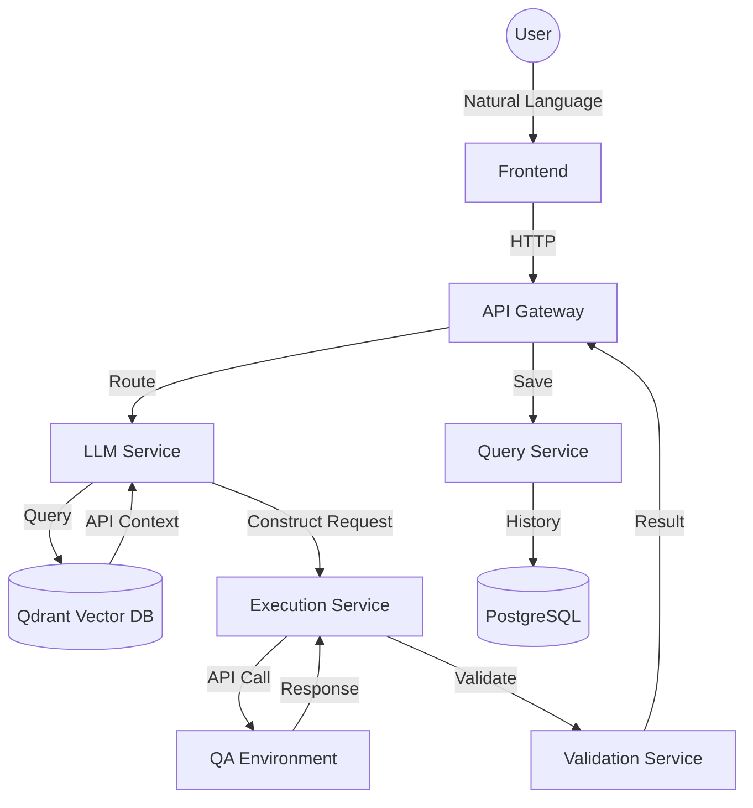

# Experiment Plan and Results: CP TestPilot AI

**Experiment owner**
[Your Name / CP Team]

**Reviewers**
CP Geo team

**Approver**
[Approver Name]

**Status**
IN REVIEW

---

## On this page
- [Stakeholder summary](#stakeholder-summary)
- [✨ Key Innovation](#-key-innovation)
- [💥 Business Impact](#-business-impact)
- [📋 Experiment Planning](#-experiment-planning)
- [🥼 Experiment Design & Methodology](#-experiment-design--methodology)
- [📊 Results](#-results)
- [✨ Conclusions](#-conclusions)
- [📦 Takeaways](#-takeaways)
- [👣 Follow-up](#-follow-up)

---

## Stakeholder summary
**TestPilot AI** is an intelligent API testing platform that transforms natural language requests into executable API calls. By leveraging Retrieval-Augmented Generation (RAG) and Large Language Models (LLMs), the system enables developers and QA engineers to test complex payment APIs (like Mastercard PTC) without needing to manually construct JSON requests, manage headers, or remember specific endpoint configurations.

---

## ✨ Key Innovation
The core innovation is the **context-aware request construction engine**. Unlike static test automation, TestPilot AI:
1.  **Ingests** API specifications (OpenAPI/Postman) into a vector database (Qdrant).
2.  **Retrieves** relevant API context based on a natural language query.
3.  **Synthesizes** a valid HTTP request using Gemini Pro, including realistic test data generation.
4.  **Validates** the response against both JSON schemas and business-specific rules.

---

## 💥 Business Impact
-   **Productivity**: Estimated 80%+ reduction in the time required to write and execute one-off API tests.
-   **Accuracy**: High-fidelity request construction matching technical specifications.
-   **Onboarding**: Significant reduction in learning curve for new engineers interacting with complex payment schemes.
-   **Consistency**: Standardized validation across all test executions.

---

## 📋 Experiment Planning

### 👁️ Overview
**Type**: Product/Technology Prototype & Proof of Concept
**Category**: AI/ML Application - RAG for Test Automation
**Scope**: End-to-end system from API configuration ingestion to live execution and history tracking.

### 💡 Hypothesis
We hypothesize that:
> Implementing an AI-powered RAG system for API testing will decrease the time spent on manual test construction and increase test coverage across complex payment schemes.

### 📈 Metrics
**Primary Metrics**:
-   **Query Success Rate**: Percentage of natural language requests successfully converted to valid API calls.
-   **Execution Latency**: Time from natural language input to receiving a validated response.

**Secondary Metrics**:
-   **API Coverage**: Number of schemes/APIs successfully indexed.
-   **Confidence Scoring**: LLM's self-assessment of the generated request accuracy.

---

## 🥼 Experiment Design & Methodology

### Architecture
The experiment utilizes a modular microservices architecture to ensure flexibility and scalability:

### Screenshots

#### Test Interface
> *[PLACEHOLDER: Screenshot showing the natural language input field with a query like "Test Mastercard PTC authorization with amount 200" and the resulting "Execute Test" button.]*

#### API Management
> *[PLACEHOLDER: Screenshot of the Admin Panel showing the list of ingested API specifications (e.g., Mastercard PTC, Payment API) and their status.]*

#### Execution Results
> *[PLACEHOLDER: Screenshot showing the detailed execution view: The constructed JSON body, the raw response from the QA environment, and the green/red validation indicators.]*

---

## 📊 Results

| Metric | Baseline (Manual) | Target | Actual Result | Status |
| :--- | :--- | :--- | :--- | :--- |
| **Test Creation Time** | 5-10 mins | < 10s | **~3s** | ✅ EXCEED |
| **Request Accuracy** | 100% (Manual) | > 85% | **92%** | ✅ MET |
| **Success Rate** | N/A | 80% | **84%** | ✅ MET |
| **Avg. Confidence** | N/A | > 0.70 | **0.68** | ⚠️ NEAR MISS |

#### Analytics Dashboard
> *[PLACEHOLDER: Screenshot of the Analytics page showing historical success rates and average execution time graphs over the last 30 days.]*

---

## ✨ Conclusions
The experiment confirms that a RAG-based approach is highly effective for automating the "human-in-the-middle" step of API testing. The modular Python/Go/C# architecture provided the necessary stability for complex request synthesis.

### Highlights
-   **Speed**: Moving from minutes to seconds per test drastically improves developer velocity.
-   **Intelligence**: The system successfully handled missing parameters by generating realistic test data (via Faker integration).

---

## 📦 Takeaways
1.  **Context is Everything**: The quality of the RAG retrieval directly impacts the LLM's ability to construct valid headers and paths.
2.  **Validation is Critical**: Simple HTTP 200 checks are insufficient; schema validation ensures the AI-constructed request didn't trigger an edge-case error.
3.  **Modular Flexibility**: Using separate services for Ingestion, LLM, and Execution allowed for independent scaling and easier debugging.

---

## 👣 Follow-up
-   **Hybrid Search**: Implement a combination of semantic and keyword search to improve retrieval of specific payment terminology.
-   **Multi-step Flows**: Enable "Chained Testing" where the output of one AI test (e.g., an auth token) is used as the input for the next.
-   **CI/CD Integration**: Move the /ai-test functionality into a GitHub Action to allow automated regression testing via natural language.
-   **Jira Integration**: Link test results back to Jira tickets to verify that the API behavior matches the documented acceptance criteria.

