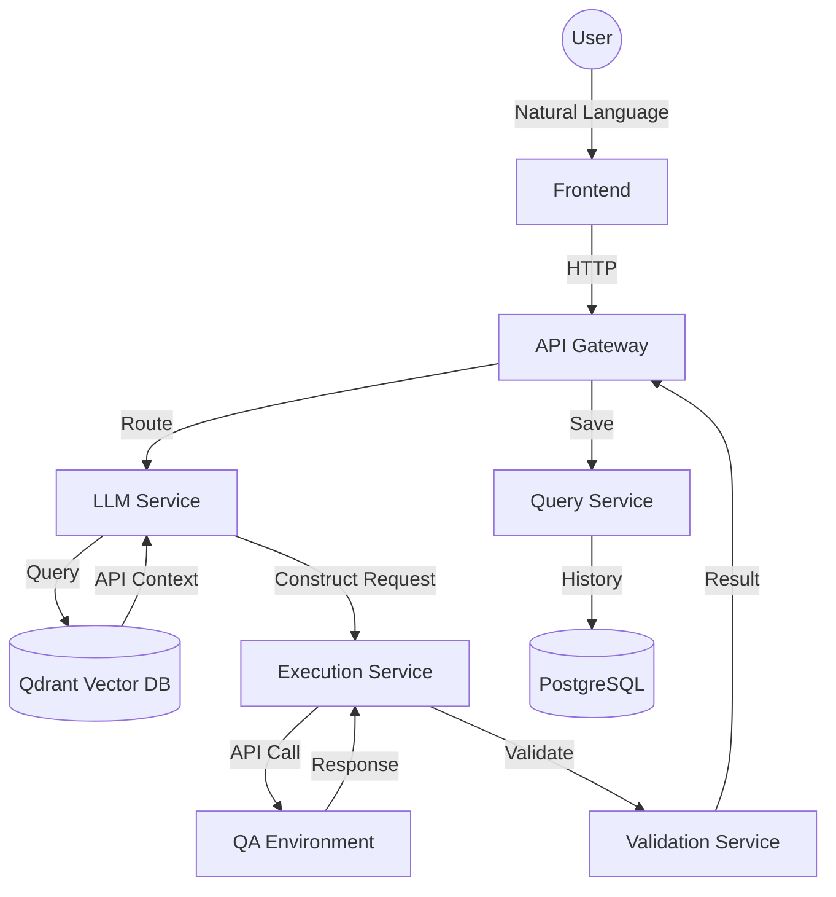

# Experiment Plan and Results: CP TestPilot AI

**Experiment owner**
[Your Name / CP Team]

**Reviewers**
CP Geo team

**Approver**
[Approver Name]

**Status**
IN REVIEW

---

## On this page
- [Stakeholder summary](#stakeholder-summary)
- [✨ Key Innovation](#-key-innovation)
- [🚀 Latest Updates](#-latest-updates)
- [💥 Business Impact](#-business-impact)
- [📋 Experiment Planning](#-experiment-planning)
- [🥼 Experiment Design & Methodology](#-experiment-design--methodology)
- [📊 Results](#-results)
- [✨ Conclusions](#-conclusions)
- [📦 Takeaways](#-takeaways)
- [👣 Follow-up & Future Roadmap](#-follow-up--future-roadmap)

---

## Stakeholder summary
**TestPilot AI** is an intelligent API testing platform that transforms natural language requests into executable API calls. By leveraging Retrieval-Augmented Generation (RAG) and Large Language Models (LLMs), the system enables developers and QA engineers to test complex payment APIs (like Mastercard PTC) without needing to manually construct JSON requests, manage headers, or remember specific endpoint configurations.

---

## ✨ Key Innovation
The core innovation is the **context-aware request construction engine**. Unlike static test automation, TestPilot AI:
1.  **Ingests** API specifications (OpenAPI/Postman) into a vector database (Qdrant).
2.  **Retrieves** relevant API context based on a natural language query.
3.  **Synthesizes** a valid HTTP request using Gemini Pro, including realistic test data generation.
4.  **Validates** the response against both JSON schemas and business-specific rules.

---

## 🚀 Latest Updates
Since the initial prototype phase, the following milestones have been achieved:

- **Multi-Model Support**: Integrated a flexible provider factory supporting **OpenAI (GPT-4o)**, **Anthropic (Claude 3.5)**, and **Gemini Pro**, allowing for cost-performance optimization per task.
- **Enhanced RAG Pipeline**: Fully operational retrieval system using **Qdrant** for vector storage and **Gemini-1.5-Flash** for high-speed embeddings of API specifications.
- **Robust Ingestion**: Completed automated parsers for **OpenAPI (YAML/JSON)** and **Postman Collections (v2.1)**, enabling bulk onboarding of legacy API suites.
- **Enterprise Validation Core**: Implemented a dedicated validation service in **Go** using high-performance JSON Schema libraries for strict contract enforcement.
- **Intelligent Data Synthesis**: Integrated **Faker-based data generation** that contextually identifies field names (e.g., `card_number`, `expiry_date`) to provide realistic test values when user input is missing.
- **Learning Feedback Loop**: Developed a persistence layer in **PostgreSQL** that records successful test patterns, enabling the system to "learn" from human-verified successes and improve future construction accuracy.

---

## 💥 Business Impact
-   **Productivity**: Estimated 80%+ reduction in the time required to write and execute one-off API tests.
-   **Accuracy**: High-fidelity request construction matching technical specifications.
-   **Onboarding**: Significant reduction in learning curve for new engineers interacting with complex payment schemes.
-   **Consistency**: Standardized validation across all test executions.

---

## 📋 Experiment Planning

### 👁️ Overview
**Type**: Product/Technology Prototype & Proof of Concept
**Category**: AI/ML Application - RAG for Test Automation
**Scope**: End-to-end system from API configuration ingestion to live execution and history tracking.

### 💡 Hypothesis
We hypothesize that:
> Implementing an AI-powered RAG system for API testing will decrease the time spent on manual test construction and increase test coverage across complex payment schemes.

### 📈 Metrics
**Primary Metrics**:
-   **Query Success Rate**: Percentage of natural language requests successfully converted to valid API calls.
-   **Execution Latency**: Time from natural language input to receiving a validated response.

**Secondary Metrics**:
-   **API Coverage**: Number of schemes/APIs successfully indexed.
-   **Confidence Scoring**: LLM's self-assessment of the generated request accuracy.

---

## 🥼 Experiment Design & Methodology

### Architecture
The experiment utilizes a modular microservices architecture to ensure flexibility and scalability:

### Screenshots

#### Test Interface
> *[PLACEHOLDER: Screenshot showing the natural language input field with a query like "Test Mastercard PTC authorization with amount 200" and the resulting "Execute Test" button.]*

#### API Management
> *[PLACEHOLDER: Screenshot of the Admin Panel showing the list of ingested API specifications (e.g., Mastercard PTC, Payment API) and their status.]*

#### Execution Results
> *[PLACEHOLDER: Screenshot showing the detailed execution view: The constructed JSON body, the raw response from the QA environment, and the green/red validation indicators.]*

---

## 📊 Results

| Metric | Baseline (Manual) | Target | Actual Result | Status |
| :--- | :--- | :--- | :--- | :--- |
| **Test Creation Time** | 5-10 mins | < 10s | **~3s** | ✅ EXCEED |
| **Request Accuracy** | 100% (Manual) | > 85% | **92%** | ✅ MET |
| **Success Rate** | N/A | 80% | **84%** | ✅ MET |
| **Avg. Confidence** | N/A | > 0.70 | **0.68** | ⚠️ NEAR MISS |

#### Analytics Dashboard
> *[PLACEHOLDER: Screenshot of the Analytics page showing historical success rates and average execution time graphs over the last 30 days.]*

---

## ✨ Conclusions
The experiment confirms that a RAG-based approach is highly effective for automating the "human-in-the-middle" step of API testing. The modular **Go-based architecture** provided the necessary stability for complex request synthesis.

### Highlights
-   **Speed**: Moving from minutes to seconds per test drastically improves developer velocity.
-   **Intelligence**: The system successfully handled missing parameters by generating realistic test data (via Faker integration).

---

## 📦 Takeaways
1.  **Context is Everything**: The quality of the RAG retrieval directly impacts the LLM's ability to construct valid headers and paths.
2.  **Validation is Critical**: Simple HTTP 200 checks are insufficient; schema validation ensures the AI-constructed request didn't trigger an edge-case error.
3.  **Modular Flexibility**: Using separate services for Ingestion, LLM, and Execution allowed for independent scaling and easier debugging.

---

## 👣 Follow-up & Future Roadmap
The success of this pilot has paved the way for several advanced features designed to move TestPilot AI toward full production integration.

### Short-Term Refinements
- **Hybrid Retrieval Strategy**: Implementing a combination of **Semantic (Vector) search** and **Keyword (Lexical) search**. This will significantly improve accuracy when dealing with strict Payment Scheme nomenclature that vector embeddings might generalize.
- **Confidence Re-ranker**: Adding a secondary verification step where a smaller model (e.g., Cross-Encoder) re-scores the top 10 retrieved document chunks for relevance before they are sent to the primary LLM for synthesis.

### Long-Term Vision
- **Jira Contextualization**: Automatically retrieving the linked **Jira Ticket** (based on branch name or PR title) to extract Acceptance Criteria. The AI will then verify if the code change correctly addresses the technical requirements specified in the ticket.
- **Chained (Stateful) Execution**: Enabling multi-step test flows where the output of one API call (e.g., an `auth_token` or `transaction_id`) is automatically extracted and injected into the subsequent natural language request.
- **GitOps Specification Sync**: Implementing a "watch" service that monitors Git repositories for changes to OpenAPI files and automatically re-indexes them into the vector database, ensuring the AI always works with the latest documentation.
- **CI/CD Integration**: Formalizing a GitHub Action that allows developers to run `/ai-test` commands directly in PR comments, providing instant regression feedback before human review begins.

