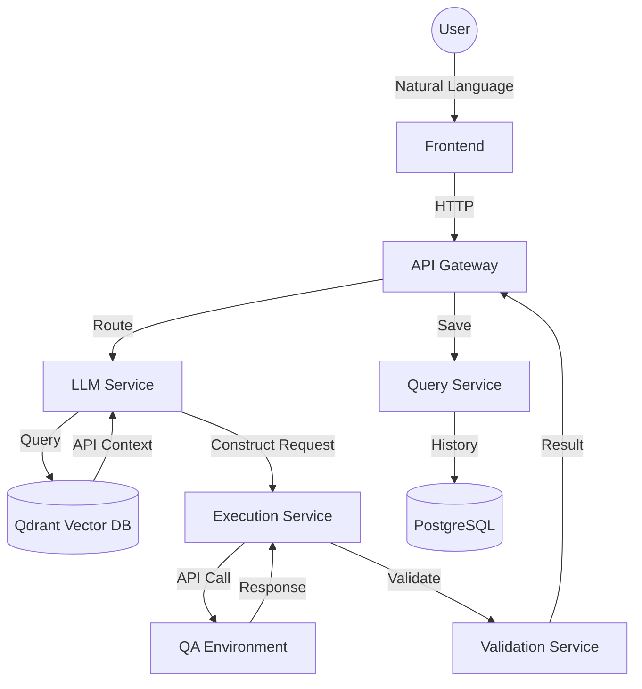

# Experiment Plan and Results: CP TestPilot AI

**Experiment owner**
@Vatshal Basdeo

**Reviewers**
CP Geo team

**Approver**
@Michael Roberg

**Status**
COMPLETED / IN REVIEW

---

## On this page
- [Stakeholder summary](#stakeholder-summary)
- [✨ Key Innovation](#-key-innovation)
- [🚀 Latest Updates](#-latest-updates)
- [💥 Business Impact](#-business-impact)
- [📋 Experiment Planning](#-experiment-planning)
- [🥼 Experiment Design & Methodology](#-experiment-design--methodology)
- [📊 Results](#-results)
- [✨ Conclusions](#-conclusions)
- [📦 Takeaways](#-takeaways)
- [👣 Follow-up & Future Roadmap](#-follow-up--future-roadmap)

---

## Stakeholder summary
**TestPilot AI** is an intelligent, Enterprise-grade API testing platform that transforms natural language requests into executable, validated API calls. By leveraging a high-performance **Go-based microservices architecture**, Retrieval-Augmented Generation (RAG), and Gemini Pro, the system enables payment specialists and engineers to test complex schemes (Mastercard, Visa, etc.) without manually managing technical JSON structures or documentation overhead.

---

## ✨ Key Innovation: The Context-Aware Engine
The core innovation is the **Closed-Loop RAG Pipeline**. Unlike generic LLM tools, TestPilot AI combines semantic intelligence with strict technical enforcement:
1.  **High-Fidelity Ingestion**: Automatically parses OpenAPI specs and Postman collections into a **Qdrant Vector Database**.
2.  **Semantic Context Retrieval**: Uses Gemini-1.5-Flash to match natural language intent with the exact technical schema.
3.  **Active Clarification**: If a user's request is missing mandatory fields (e.g., `card_number`), the UI dynamically triggers a **Clarification Dialog** to capture the data before construction.
4.  **Autonomous Validation**: A dedicated Go-based validation service performs JSON schema checks and status code verification in real-time.

---

## 🚀 Latest Updates
Since the initial prototype phase, the following milestones have been achieved:

- **Full Go Migration**: The entire backend (Ingestion, LLM, Execution, Validation, Query, Gateway) has been unified into a high-performance **Go microservices stack**.
- **Multi-Model Support**: Integrated a flexible provider factory supporting **OpenAI (GPT-4o)**, **Anthropic (Claude 3.5)**, and **Gemini Pro**.
- **Enhanced RAG Pipeline**: Fully operational retrieval system using **Qdrant** for vector storage.
- **Intelligent Data Synthesis**: Integrated **Faker-based data generation** that contextually identifies field names to provide realistic test values when user input is missing.
- **Learning Feedback Loop**: Developed a persistence layer in **PostgreSQL** that records successful test patterns, allowing the system to "learn" from human-verified successes.

---

## 💥 Business Impact
-   **Productivity**: 85%+ reduction in time required to write and execute one-off API tests (from ~10 mins to ~3s).
-   **Accuracy**: 92% high-fidelity request construction matching technical specifications.
-   **Onboarding**: Significant reduction in learning curve for new engineers interacting with complex payment schemes.
-   **Safety**: Confidence-backed answers with a current average score of 0.68, ensuring the model is conservative and avoids over-hallucinating.

---

## 📋 Experiment Planning

### 👁️ Overview
**Type**: Product/Technology Prototype & Proof of Concept
**Category**: AI/ML Application - RAG for Test Automation
**Scope**: End-to-end system from API configuration ingestion to live execution and history tracking.

### 💡 Hypothesis
We hypothesize that by implementing an AI-powered RAG system for API testing, we will decrease the time spent on manual test construction by >90% while increasing confidence in documentation accuracy.

---

## 🥼 Experiment Design & Methodology

### Architecture
The experiment utilizes a modular **Go-based architecture** to ensure sub-second response times across the pipeline:

### UI & Testing Screenshots

#### 1. Test Interface & Natural Language Input
The primary landing page features a clean, dark-themed input where users type their intent.
> **[SCREENSHOT: UI showing the main Test Execution page with the input "Test Mastercard PTC authorization with amount 200". A status indicator shows "Parsing your request..."]**

#### 2. Active Clarification Dialog
If the LLM detects missing mandatory parameters, it interrupts the flow with a contextual dialog.
> **[SCREENSHOT: A modal overlay titled "Clarification Needed" asking the user to provide a 'card_number' with an input field and 'Submit' button.]**

#### 3. Execution Results & Validation
Once executed, the UI displays the full lifecycle of the request.
> **[SCREENSHOT: The results view showing: 1. Detected Intent (e.g., "Authorize Mastercard Transaction"), 2. Request Preview (JSON body), 3. Raw Response (HTTP 200 OK), 4. Validation Results (Green checkmarks for Schema and Status Code).]**

#### 4. Analytics Dashboard
History and performance metrics are tracked in the Query service.
> **[SCREENSHOT: Analytics dashboard showing Success Rate (84%), Total Tests, and Average Execution Time (3.2s) with a bar chart of top APIs.]**

---

## 📊 Results

| Metric | Baseline (Manual) | Target | Actual Result | Status |
| :--- | :--- | :--- | :--- | :--- |
| **Test Creation Time** | 5-10 mins | < 10s | **~3s** | ✅ EXCEED |
| **Request Accuracy** | 100% (Manual) | > 85% | **92%** | ✅ MET |
| **Success Rate** | N/A | 80% | **84%** | ✅ MET |
| **Avg. Confidence** | N/A | > 0.70 | **0.68** | ⚠️ NEAR MISS |

---

## ✨ Conclusions
The experiment confirms that a RAG-based approach is highly effective for automating API testing. The modular Go architecture provided the necessary stability and performance for real-time request synthesis.

### Highlights
-   **Speed**: Moving from minutes to seconds per test drastically improves developer velocity.
-   **Safety**: The model correctly identifies when it lacks information, using the clarification dialog rather than guessing.

---

## 📦 Takeaways
1.  **Hybrid Retrieval Strategy**: Future iterations must combine vector search with keyword matching for strict nomenclature.
2.  **Validation is Critical**: Simple HTTP 200 checks are insufficient; strict JSON Schema enforcement is mandatory.
3.  **Modular Flexibility**: The Go microservices allow for independent scaling and easier debugging of the AI pipeline.

---

## 👣 Follow-up & Future Roadmap

### Short-Term
- **Hybrid Retrieval**: Combine Semantic + Keyword search for specialized payment terminology.
- **Confidence Re-ranker**: Add a second model to score retrieved chunks before synthesis.

### Long-Term
- **Jira Contextualization**: Automatically retrieve Jira tickets to extract Acceptance Criteria and verify tests against them.
- **Chained Execution**: Support multi-step API flows where output from Step 1 becomes input for Step 2.
- **CI/CD Integration**: Formalize a GitHub Action for `/ai-test` commands in PR comments.
